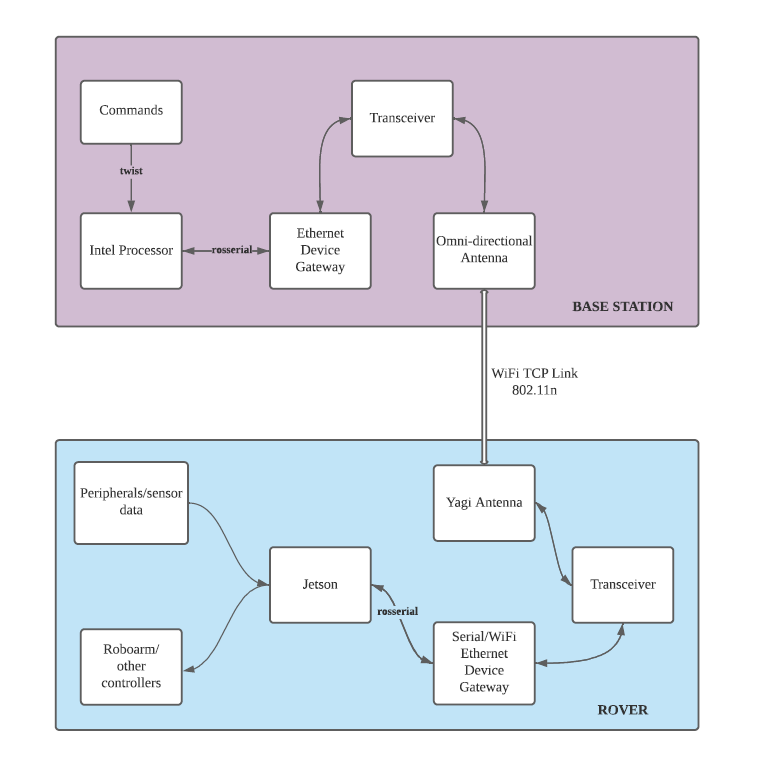

* Table of Contents
{:toc}

:information_source: **Current Stage:** Designing system architecture.

:satellite: **Meeting 24/10/2020:** Antennae Selection

**Choices:**  

:part_alternation_mark: Maybe

:x: No 

:white_check_mark: Yes!!!! 

1) :part_alternation_mark: https://www.air802.com/antenna-wifi-omni-directional-2.4-ghz-8-dbi-outdoor-mast-mount.html(linear polarization) 

2) :white_check_mark: https://sg.element14.com/siretta/oscar40-5m-ll-smam-s-s-33/omni-antenna-800mhz-2-7ghz-sma/dp/2717692 (linear, vertical polarization) 

3) :part_alternation_mark: https://www.amazon.com/Tupavco-TP513-Antenna-2-4GHz-17dBi/dp/B008Z4I7WQ/ref=sr_1_13?dchild=1&keywords=2.4ghz+antenna&qid=1603305844&sr=8-13 (horizontal, vertical polarization) 

4) :part_alternation_mark: https://www.data-alliance.net/antenna-15dbi-2-4ghz-omni-directional-wifi-vertical-polarization/ 

5) :part_alternation_mark: https://www.amazon.com/Wireless-Connector-Amplifier-TupavcoTP551/dp/B07YGPDPW8/ref=pd_lpo_147_t_0/138-1771804-9361906?_encoding=UTF8&pd_rd_i=B07YGPDPW8&pd_rd_r=db659890-2d3e-4893-acf5-98c7f37b92a1&pd_rd_w=zDAui&pd_rd_wg=Fbg7x&pf_rd_p=7b36d496-f366-4631-94d3-61b87b52511b&pf_rd_r=MS1SFFD1E8Y4YNDZNX4B&psc=1&refRID=MS1SFFD1E8Y4YNDZNX4B 

6) :x: https://www.lazada.sg/products/tiptop-new-18dbi-omni-wifi-698-2700mhz-n-male-outdoor-lte-4g-antenna-for-communication-1pcs-i1025934541-s3781142584.html?exlaz=d_1:mm_150050845_51350205_2010350205::12:1025267241!54483208270!!!pla-297963845945!c!297963845945!3781142584!137304050&gclid=EAIaIQobChMI_bmd-LTI7AIVwQorCh2WGgrHEAQYDCABEgLpefD_BwE 

7) :x: https://www.mouser.sg/ProductDetail/RF-Solutions/ANT-GSM-YAG11?qs=17u8i%2FzlE89zDn%252BZhooW5A%3D%3D 

8) :white_check_mark: https://www.l-com.com/Images/Downloadables/Datasheets/ds_HG2415U-PRO.pdf(vertical) 

9) :white_check_mark: https://static.engeniuscdn.com/wp-content/uploads/2019/04/25074856/sector_antenna_111315-1.pdf 
Seller: https://www.engeniustech.com.sg/products/wireless/accessories/sa2216 

:satellite: Meeting 19/11/2020 - System Architecture

:information_source: **Current Stage:** Confirmed Ubiquiti M2 Base Station

 

 